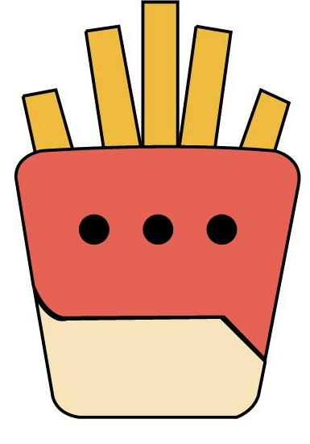

# Ketch Up!

## Introduction

a Real-time collabration app. You can create a channel for anything worth discussing, from team projects to company-wide initiatives. You can also make a google doc and sheet through the app with your partner!

## Pages

### Home Page

user able to sign in with Google account and password

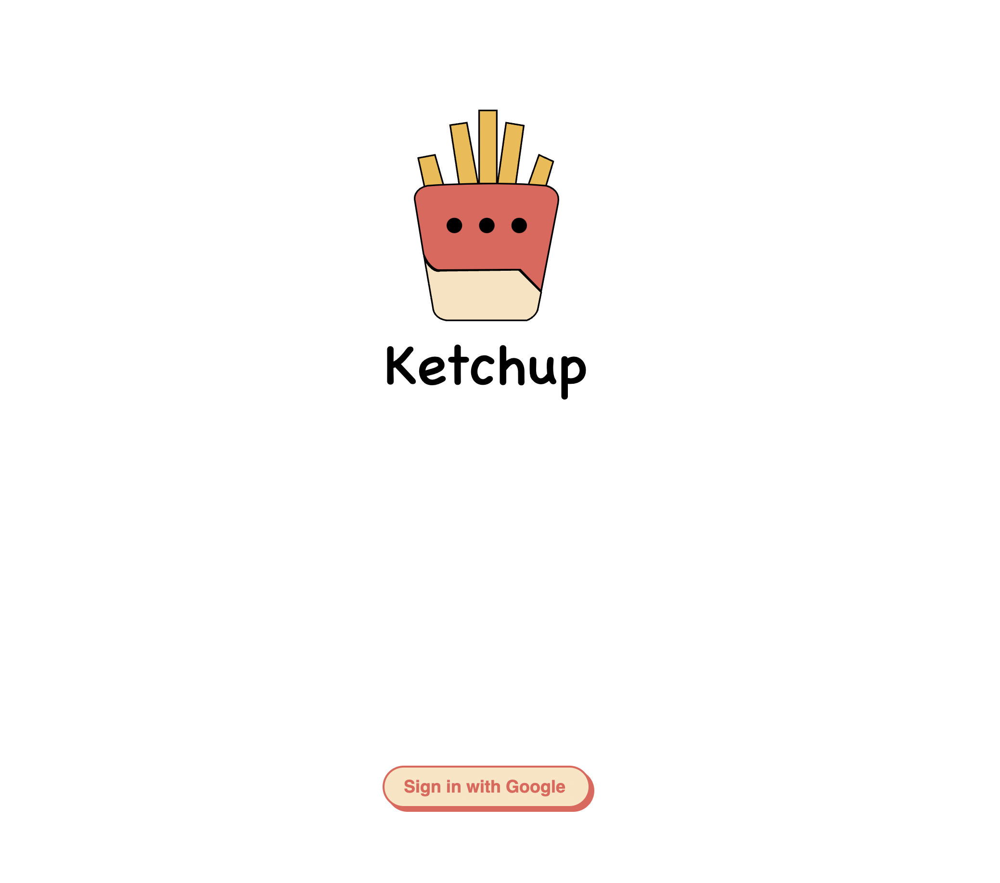

### Welcome Page

user will see their name and profile picture, and they can invite their partner with email.


email required validation
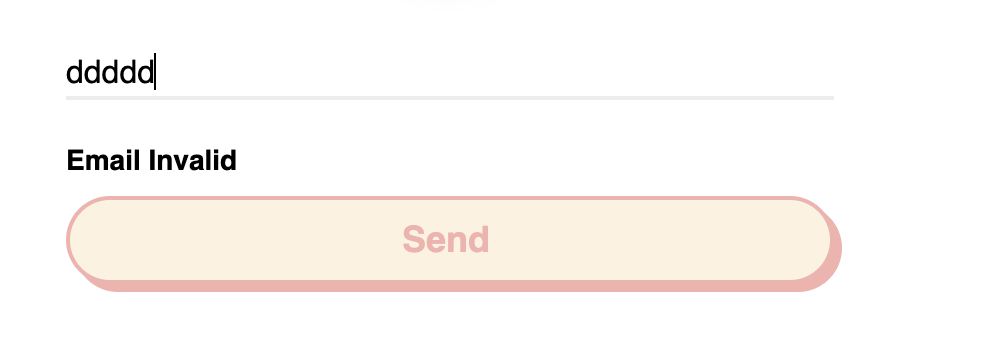

### Chat Room

user can chat with partner in a specific chatroom
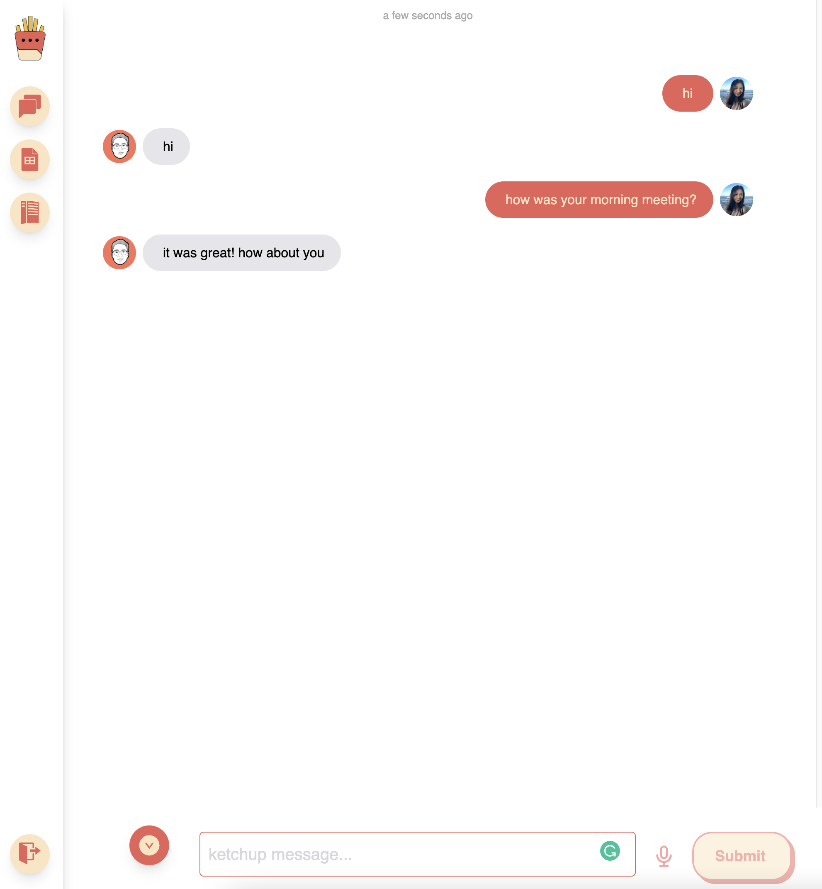

messages will have updated timestamps. shows every 15 minutes
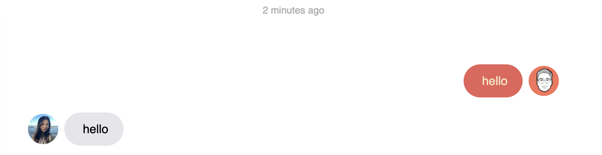

user able to speech to text
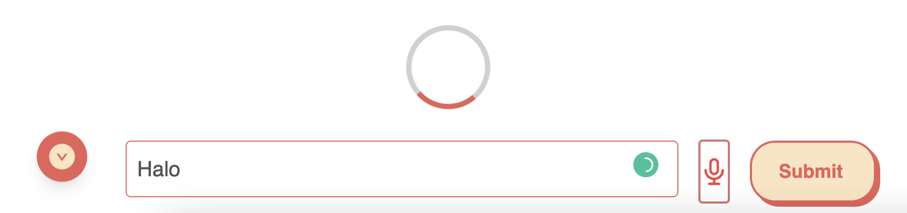

user able to send multi-line messages, the button on the left able to scroll down the page
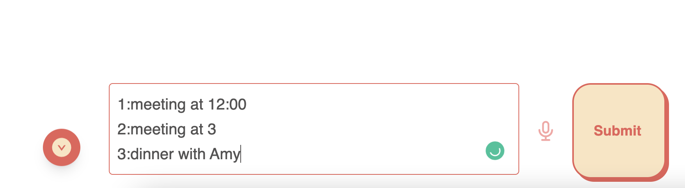

### Google Doc and Google Sheet

user able to create a new google doc or sheet
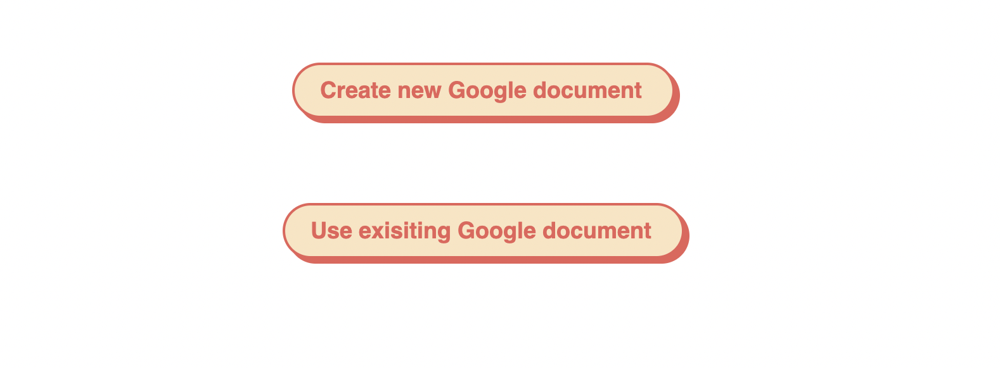
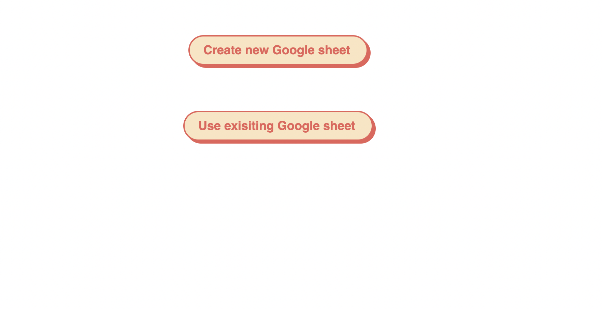

user able to open a exiting google doc or sheet

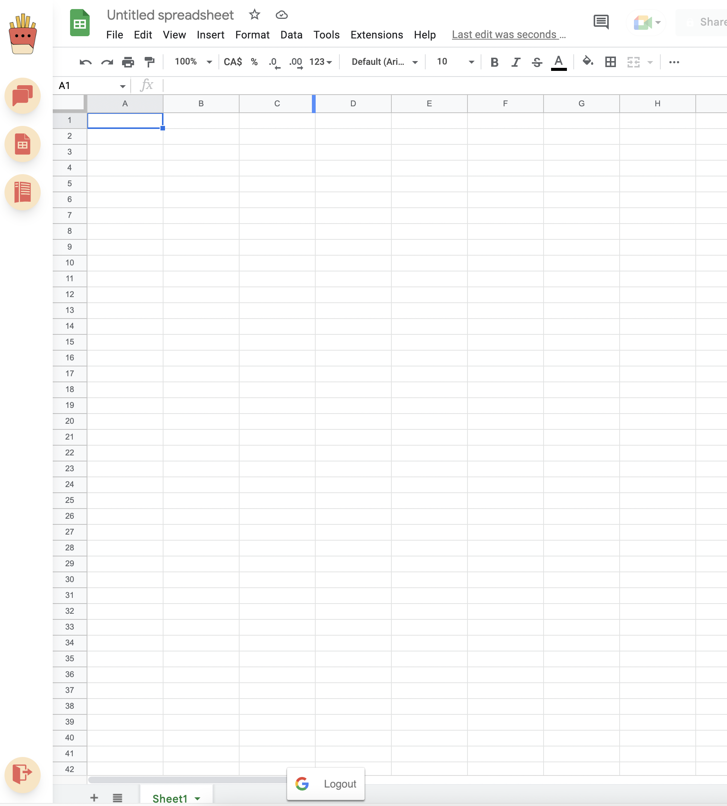

### Side Bar

side bar will always visible on the left side of the page
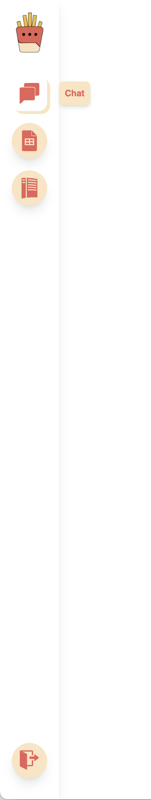

user will able to access to chat ---- chat room list pop up window

user will able to access to google doc and google sheet page

user will able to log out

## Setup

Install dependencies with `npm install --force`.

## Running Webpack Development Server

```sh
npm start
```
